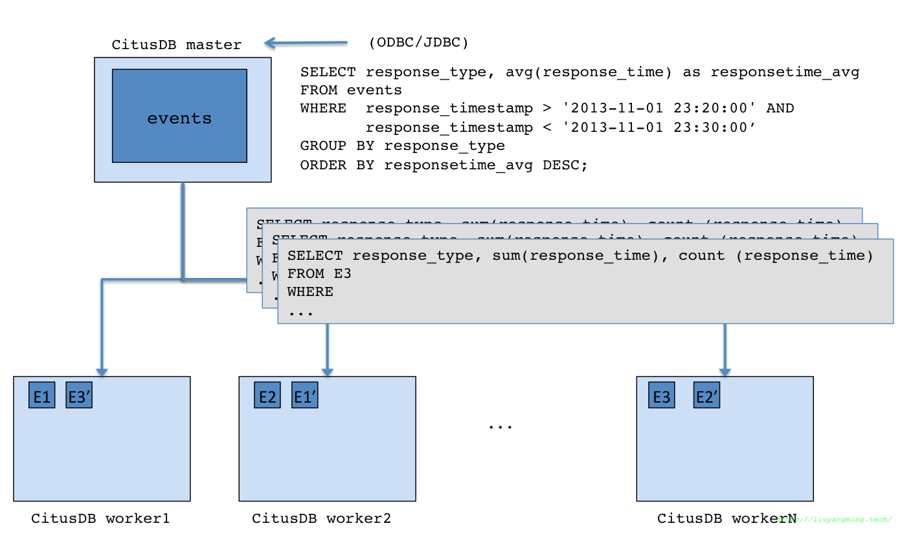

## 简介

CitusDB通过分片(shard)和复制(replication)在物理数据库集群和虚拟机上扩展Postgresql。
其查询引擎将得到的SQL查询，并行化分布到这些机器上，从而支持实时查询

CitusDB并不是Postgresql的一个分支，而是Postgresql的一个扩展，其开发的方式是利用Postgresql的hook和extension API。

### 架构图



### 逻辑分区

类似于HDFS分布式存储的BLOCK，CitusDB使用Postgresql的Table代替file，这些存储在Postgresql中的若干表都是水平分割或者是逻辑分片。于是在Master节点上，就维护了元数据表，来记录所有的节点和节点上的shards。

每个shard在两个或若干节点上备份。并且CitusDB可以随时添加节点，来水平扩展存储和计算的能力。

### 元数据表

Master中维护这元数据表，其中记录着:

+ 所有的cluster nodes

+ shard在这些node上的分布

+ 一些统计信息，

  比如这些shard的size，min/max，这些统计信息可以用来优化查询计划。
  这些元数据表很小（基本就是MB级别）。可以做备份，来应对主节点宕机。
  如下一些元数据表示例：

```sql
SELECT * from pg_dist_partition;
 logicalrelid | partmethod |                                                        partkey
--------------+------------+-------------------------------------------------------------------------------------------------------------------------
       488843 | r          | {VAR :varno 1 :varattno 4 :vartype 20 :vartypmod -1 :varcollid 0 :varlevelsup 0 :varnoold 1 :varoattno 4 :location 232}
(1 row)

SELECT * from pg_dist_shard;
 logicalrelid | shardid | shardstorage | shardalias | shardminvalue | shardmaxvalue
--------------+---------+--------------+------------+---------------+---------------
       488843 |  102065 | t            |            | 27            | 14995004
       488843 |  102066 | t            |            | 15001035      | 25269705
       488843 |  102067 | t            |            | 25273785      | 28570113
       488843 |  102068 | t            |            | 28570150      | 28678869
(4 rows)

SELECT * from pg_dist_shard_placement;
 shardid | shardstate | shardlength | nodename  | nodeport
---------+------------+-------------+-----------+----------
  102065 |          1 |     7307264 | localhost |   9701
  102065 |          1 |     7307264 | localhost |   9700
  102066 |          1 |     5890048 | localhost |   9700
  102066 |          1 |     5890048 | localhost |   9701
  102067 |          1 |     5242880 | localhost |   9701
  102067 |          1 |     5242880 | localhost |   9700
  102068 |          1 |     3923968 | localhost |   9700
  102068 |          1 |     3923968 | localhost |   9701
(8 rows)
```

### 错误处理

类似于HDFS存储策略，若其中有一个节点宕机了，但是别的节点上存在这个数据，那么就可以将，查询这些数据的请求发到其他有这些数据的节点上。
如果这个节点是永久宕机，那么rebalance这些数据即可。

### 分布式DDL和DML

CitusDB是基于PostgreSQL的hook和扩展API开提供分布式功能的。这就允许用户从PostgreSQL丰富的生态圈中受益。比如，

+ 丰富的数据类型（半结构化数据，Jsonb(json-binary)和Hstore）、操作符和函数、全文索引、PostGIS ...
+ 另外，合理的使用扩展API同样可以使用标准的PostgreSQL的工具，pg_Admin,pg_backup,pg_upgrade;

设计基于以上架构的分布式数据库，需要考虑两个问题，Distribution Column和Distribution Method

#### Distribution Column

CitusDB中的Distributed Column都有一个列作为Distributed Column，Master维护这个列在每个节点统计信息。
分布式查询计划优化器可以基于这个信息来优化查询。一般选经常作为连接条件，或者过滤条件的列。
这样可以减少网络传输的代价，让一些操作下推到单个节点上执行。比如，比较常用的列就是：  

1. 时间列
2. ID列

#### Distributed Method

选好数据列后，就是选择Distributed Method：append或者hash。CitusDB同样也支持 range Distribution，但是需要手动设置。

1. Append Distribution  

从名字上来理解，append Distribution适合于**append-only**的例子，比如，按时间顺序加载的数据，像网站日志这种的。
append Distribution支持高效的范围查询。  

``` sql
CREATE TABLE github_events
(
    event_id bigint,
    event_type text,
    event_public boolean,
    repo_id bigint,
    payload jsonb,
    repo jsonb,
    actor jsonb,
    org jsonb,
    created_at timestamp
) 
-- DISTRIBUTE BY APPEND (created_at);这种方法是在4.0里，现在已经过时了
SELECT master_create_distributed_table('github_events', 'created_at', 'append');
```

2. Hash Distribution  

比如userid这种并没有顺序的列，用户能够实时的分析，插入的case。这样CitusDB维护了每个hash range shard的min/max。当一个行被`insert delete update`的时候，直接找到对应的node，本地执行。这种方式适合于co-located join和等值查询

> co-located join: 文件中相关的数据行在一个节点上，这样join的时候数据就不用在节点之间移动了，提高效率；

``` sql
CREATE TABLE github_events
(
    event_id bigint,
    event_type text,
    event_public boolean,
    repo_id bigint,
    payload jsonb,
    repo jsonb,
    actor jsonb,
    org jsonb,
    created_at timestamp
);
SELECT master_create_distributed_table('github_events', 'repo_id', 'hash');
```

3. range Distribution

range 意思是所有的shard在distribution key上没有重合的range。默认的并不强制每个shard上没有重叠。
(append主要强调的是append-only)，range分布的时候如果没有顺序需要排个序。

``` sql
/opt/citusdb/4.0/bin/psql -h localhost -d postgres
CREATE TABLE github_events
(
    event_id bigint,
    event_type text,
    event_public boolean,
    repo_id bigint,
    payload jsonb,
    repo jsonb,
    actor jsonb,
    org jsonb,
    created_at timestamp
) 
-- DISTRIBUTE BY RANGE (repo_id);
SELECT master_create_distributed_table('github_events', 'repo_id', 'range');
```

### 查询执行

用户的查询请求，被master node分割成很多的查询片段，被发给每个shard，在每个shard上可以独立执行。这允许CitusDB来将每个查询分布到集群的各个节点上执行，用尽每一个参与节点以及参与节点的每个cpu。将查询请求发给每个节点后，Master负责监视节点的执行以及合并他们的结果，然后返回给用户；

为了保证所有的查询分布的行为是可扩展的，Master节点同时也应用了一些优化的手段来最小化节点之间的传输数据。

CitusDB的SQL查询计划分为两个阶段。
第一个阶段是将SQL转换成可交换的（**commutative**）、可组合的（**associative**）的形式。这样查询就可以下推到worker node来并发执行
第二个阶段就是在workernode上的PostgreSQL，来执行接收到的查询请求。

#### Aggregate Functions

如果是Distribution Column，那么就可以下推到每个节点执行。如果不是，那么需要重新划分底层数据。 

针对这一问题，CitusDB提供了基于**HyperLoglog**算法，来计算非分布式列的近似值

#### Joins

对于大表和小表的Join执行策略是不一样的。一般来说，事实表是大表，维表是小表。

1. Broadcast Join

大表和小表的Join,将小表复制发送到大表shard存在的node上，然后本地执行

2. Colocated Join

两个大表Join ，满足条件 **Distributed Column上的Join，并且表是Hash Distributed **。
这样Master可以知道哪些shard和哪些shard是匹配的。排除掉不可能结果的shard之间的join。

3. Repartition join 

不满足上述条件的大表Join。增加一个repartition的shuffle过程。

